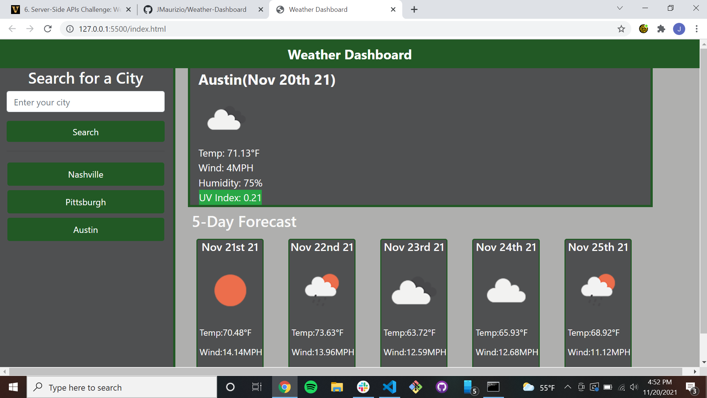
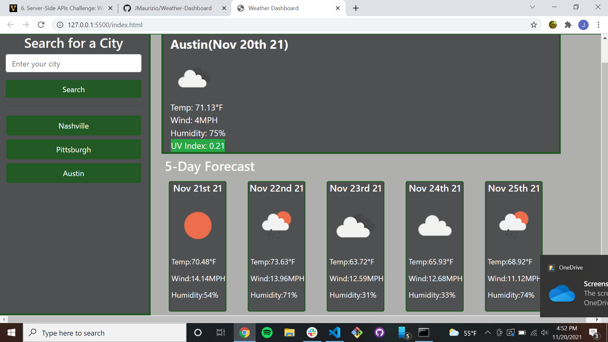
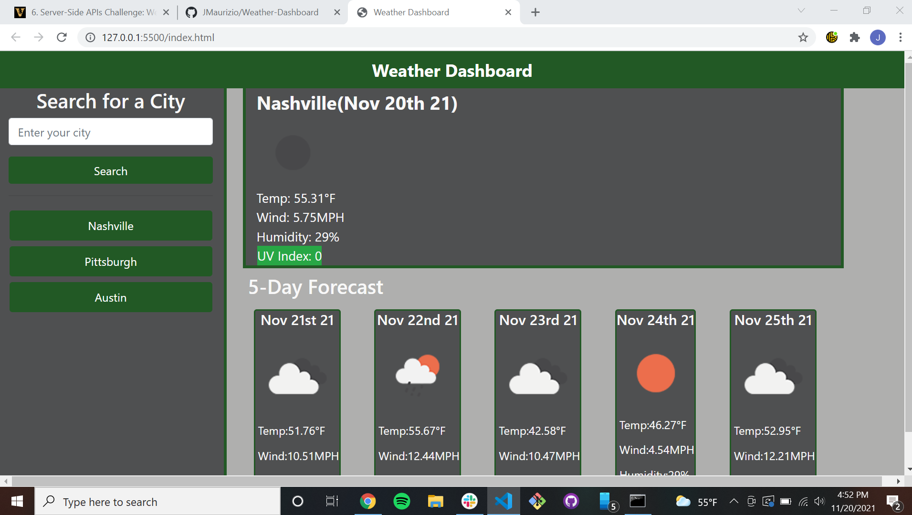

# Weather-Dashboard

This is my completed weather dashboard using the OpenWeather API.  The app is fuctioning properly however there are a few things to note.  The original API did not have all the information needed to populate the dashboard.  Therefore a second API call was made using the longitude and latitude form the first API call to get all the data needed.  The only other thing I would like to note is that the current and future date format in the API was not fuctioning so I employed moment.js to display the current date and time of each forecast.  Located below are some screenshots and links to the application.

GitHub Pages link:
https://jmaurizio.github.io/Weather-Dashboard/

GitHub Repo link:
https://github.com/JMaurizio/Weather-Dashboard

